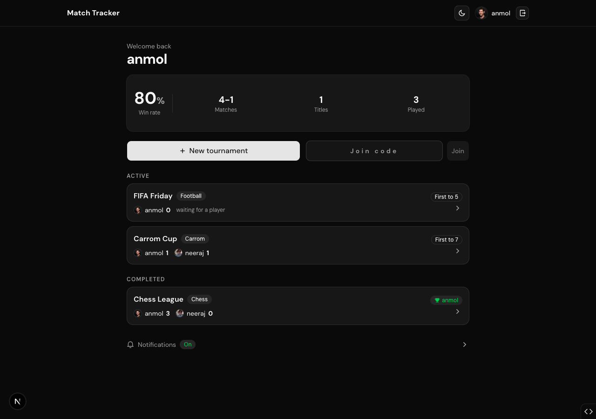
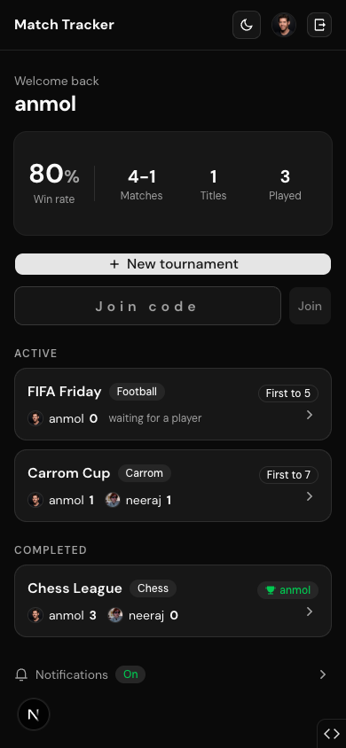
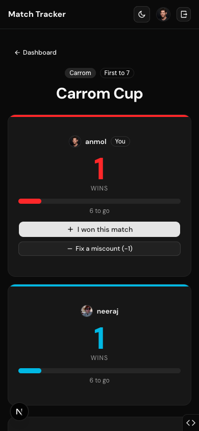

<div align="center">

# 🏆 Match Tracker

### Settle it on the scoreboard, not in the group chat.

A head-to-head win tracker for **any** game or tournament: chess, cricket, carrom, FIFA, Monster, or whatever you and your friends are competing at. Sign in with GitHub, invite a friend with a **4-digit code**, and every result is confirmed by the other player before it counts.

<br/>

[](https://tournament-score-tracker-web.vercel.app)
&nbsp;
[](https://nextjs.org)
[](https://hono.dev)
[](https://neon.tech)
[](https://bun.sh)

<br/>



</div>

<br/>

## ✨ Features

- 🔐 **GitHub sign-in only** — your identity is your GitHub account (username + avatar). No passwords, no guest mode.
- 🎟️ **Invite with a 4-digit code** — no long links to copy; your friend just types the code.
- 🤝 **Every win is confirmed** — you claim a win, the _other_ player confirms it. You can never confirm your own claim, and no one can edit a score alone.
- 🔒 **Private tournaments** — only invited GitHub users can view or play. Everyone else is locked out.
- 📊 **Lifetime stats** — win rate, matches won/lost, tournaments played and won, all tracked per player.
- 🔔 **Push notifications** — get an [ntfy](https://ntfy.sh) alert when a result needs your confirmation or a tournament is decided.
- 📱 **Mobile-first** — designed for the phone in your hand while you play.
- 🗑️ **Full control** — fix miscounts, request a reset, start a rematch, or delete a tournament you own.

<br/>

<div align="center">

|                       Dashboard (mobile)                        |                      Live tournament                      |
| :-------------------------------------------------------------: | :-------------------------------------------------------: |
|  |  |

</div>

<br/>

## 🎮 How it works

1. **Create a tournament** — name it, pick the game, and set how many wins take the crown (first to 3, 5, 11, or any number).
2. **Invite your opponent** — share the **4-digit code**. They sign in with GitHub and type it in.
3. **Claim your wins** — after each match, the winner taps **"I won this match."**
4. **Opponent confirms** — the result only counts once the other player confirms it. Reject it if it's wrong.
5. **First to the target wins** 🏆 — the tournament is frozen, the champion is crowned, and it's saved to both players' stats forever. Rematch anytime.

> **Why confirmation?** The frontend can never change a score on its own. It only creates a _pending request_; the backend applies the change only after the other player approves it. No arguments, no cheating.

<br/>

## 🧱 Tech stack

| Layer             | Tech                                                          |
| ----------------- | ------------------------------------------------------------- |
| **Web**           | Next.js 16 (App Router, React 19), Tailwind CSS v4, shadcn/ui |
| **API**           | Hono, end-to-end typed via RPC                                |
| **Database**      | PostgreSQL (Neon) + Drizzle ORM                               |
| **Auth**          | Better Auth (GitHub OAuth)                                    |
| **Notifications** | ntfy (server-side push)                                       |
| **Runtime**       | Bun + Turborepo monorepo                                      |
| **Hosting**       | Vercel (web + API as separate projects)                       |

Built on [ZeroStarter](https://zerostarter.dev).

<br/>

## 🚀 Local development

**Prerequisites:** [Bun](https://bun.sh), and a PostgreSQL database (local Docker or a Neon connection string).

```bash
# 1. Install
bun install

# 2. Configure — copy the example and fill in the values
cp .env.example .env
```

Set in `.env`:

```bash
POSTGRES_URL=postgres://...
BETTER_AUTH_SECRET=$(openssl rand -base64 32)
GITHUB_CLIENT_ID=...        # OAuth App, callback http://localhost:4000/api/auth/callback/github
GITHUB_CLIENT_SECRET=...
```

```bash
# 3. Migrate the database
bun run db:migrate

# 4. Run it
bun run dev
```

- Web → http://localhost:3000
- API → http://localhost:4000 · docs at `/api/docs`

<br/>

## 🏗️ Architecture notes

The web app and API deploy as **two separate Vercel projects**. To keep auth cookies **first-party** (so Safari/Chrome third-party-cookie blocking never breaks sign-in), the browser only ever talks to the web origin — Next.js proxies `/api/*` to the API server-side. Scores are **authoritative on the backend**: the client can only create pending requests, and a score changes only after the opponent confirms.

<br/>

<div align="center">

**[▲ Try it live →](https://tournament-score-tracker-web.vercel.app)**

<sub>Made for two brothers who couldn't agree on the score.</sub>

</div>
